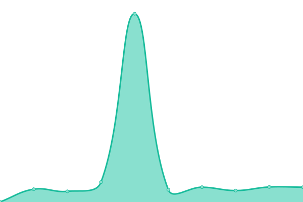

# [📈 Live Status](https://alvarezrrj.github.io/timba-upptime): <!--live status--> **🟧 Partial outage**

This repository contains the open-source uptime monitor and status page for [Rodrigo Alvarez](https://alvarezrrj.github.io/upptime), powered by [Upptime](https://github.com/upptime/upptime).

With [Upptime](https://upptime.js.org), you can get your own unlimited and free uptime monitor and status page, powered entirely by a GitHub repository. We use [Issues](https://github.com/alvarezrrj/upptime/issues) as incident reports, [Actions](https://github.com/alvarezrrj/upptime/actions) as uptime monitors, and [Pages](https://alvarezrrj.github.io/upptime) for the status page.

<!--start: status pages-->
<!-- This summary is generated by Upptime (https://github.com/upptime/upptime) -->
<!-- Do not edit this manually, your changes will be overwritten -->
<!-- prettier-ignore -->
| URL | Status | History | Response Time | Uptime |
| --- | ------ | ------- | ------------- | ------ |
|  timba | 🟥 Down | [timba.yml](https://github.com/alvarezrrj/timba-upptime/commits/HEAD/history/timba.yml) | 

 2598ms
     
 | 

<a href="https://alvarezrrj.github.io/timba-upptime/history/timba">0.00%</a>
    

|  timba-api | 🟥 Down | [timba-api.yml](https://github.com/alvarezrrj/timba-upptime/commits/HEAD/history/timba-api.yml) | 

 2401ms
     
 | 

<a href="https://alvarezrrj.github.io/timba-upptime/history/timba-api">0.00%</a>
    

|  agent-timba | 🟥 Down | [agent-timba.yml](https://github.com/alvarezrrj/timba-upptime/commits/HEAD/history/agent-timba.yml) | 

 411ms
     
 | 

<a href="https://alvarezrrj.github.io/timba-upptime/history/agent-timba">0.00%</a>
    

|  [casinomex.vip](https://casinomex.vip) | 🟩 Up | [casinomex-vip.yml](https://github.com/alvarezrrj/timba-upptime/commits/HEAD/history/casinomex-vip.yml) | 

 526ms
     
 | 

<a href="https://alvarezrrj.github.io/timba-upptime/history/casinomex-vip">100.00%</a>
    

|  [banxico](https://www.banxico.org.mx/cep/valida.do) | 🟩 Up | [banxico.yml](https://github.com/alvarezrrj/timba-upptime/commits/HEAD/history/banxico.yml) | 

 691ms
     
 | 

<a href="https://alvarezrrj.github.io/timba-upptime/history/banxico">99.79%</a>
    

<!--end: status pages-->

[**Visit our status website →**](https://alvarezrrj.github.io/timba-upptime)

## 📄 License

- Powered by: [Upptime](https://github.com/upptime/upptime)
- Code: [MIT](./LICENSE) © [Anand Chowdhary](https://anandchowdhary.com), supported by [Pabio](https://pabio.com)
- Data in the `./history` directory: [Open Database License](https://opendatacommons.org/licenses/odbl/1-0/)
